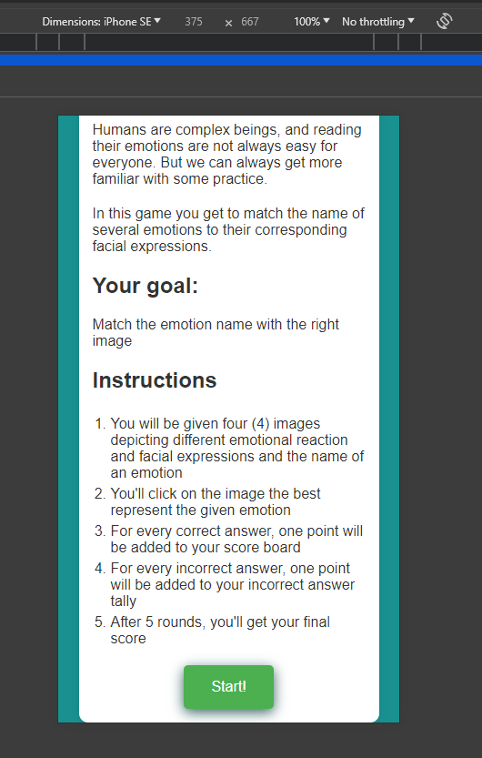
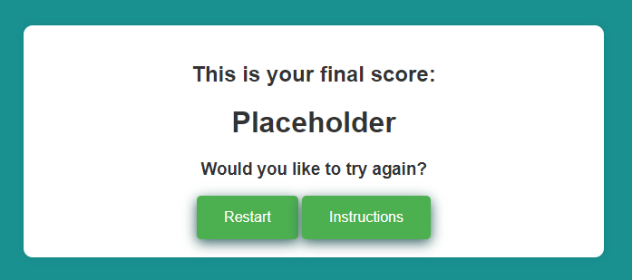
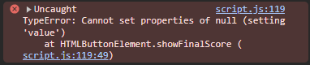

# Tests
function startNewGame() {
    homePageDiv.style.display = "none";
    gamePageDiv.style.display = "block";

    const selectedEmotions = getRandomEmotions(emotions, 4);
    const correctEmotionIndex = Math.floor(Math.random() * 4);
    const correctEmotion = selectedEmotions[correctEmotionIndex];

    console.log("Selected Emotions:", selectedEmotions);
    console.log("Correct Emotion Index:", correctEmotionIndex);
    console.log("Correct Emotion:", correctEmotion);

    By running the game multiple times and observing the console output on Chrome Devtools, I verified that the correct emotion appears in a random position each time. The correctEmotionIndex will vary between 0 and 3, ensuring the correct emotion's image is displayed in a different position for each game round.

# Credits
https://stackoverflow.com/questions/2532218/pick-random-property-from-a-javascript-object Logic to obtain random emotions from the emotion object was adapted from this answer

https://www.w3schools.com/jsref/jsref_foreach.asp Explanation and examples of the "forEach" method were taken from this tutorial from W3Schools

# Bugs
When inspecting the deployed website and visualizing it on mobile resolutions, the top of the home page div touch the top and bottom of the screen, not showing the padding nor scrolling all the way for some reason yet unkown. When opening the page on a mobile device, the website looks as it should.



Final score didn't update, keeping the placeholder text at the end of game.



Chrome Devtools indicated the problem in the JavaScript:



```
document.getElementById("final-scre").value = `Fi...
```

instead of 

```
document.getElementById("final-score").textContent = `Fi
```