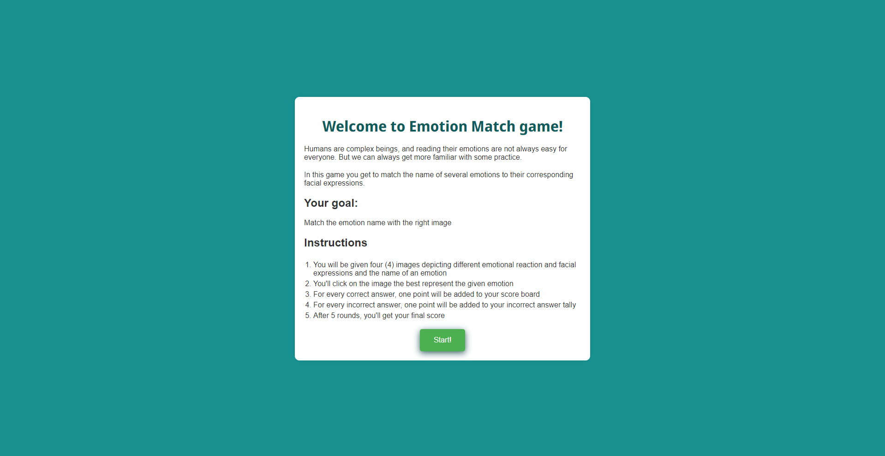

# Emotion Match Game

The Emotion Match Game is a online quiz game designed to improve people's emotion literacy by increasing their emotional vocabulary and thus to better express their feelings. The concept of the emotion wheel is widely present in the psychology field as well as schools. The game will be useful for people who  can't easily read emotional cues in social situations. That includes children, emotionally blocked adults and people with mental diagnostics that affect their social abilities.

The user must match the randomly given emotion with the image that best depicts it, increasing their final score.

## Table of contents
1. <a href="#ux-design">UX Design</a> 
2. <a href="#features">Features</a>
3. <a href="#technologies-used">Technologies used</a>
4. <a href="#testing">Testing</a>
5. <a href="#bugs">Bugs</a>
6. <a href="#validator-testing">Validator testing</a>
7. <a href="#deployment">Deployment</a>
8. <a href="#credits">Credits</a>
9. <a href="#acknowledgements">Acknowledgements</a>

# UX Design

# Features

### Home page

The landing page includes a title, a welcome message, the goal of the game and a list of instructions. From the get go, the user know what the game is about, why and how to play it.
Below the instructions, there is the "Start!" button, taking the user directly to the first round of the game.



### Game page


## Features left to implement
Add variations of images depending of user cultural background

# Technologies used
- Adobe Photoshop to create image for favicon
-  to create favicon files

# Testing
    function startNewGame() {
        homePageDiv.style.display = "none";
        gamePageDiv.style.display = "block";

        const selectedEmotions = getRandomEmotions(emotions, 4);
        const correctEmotionIndex = Math.floor(Math.random() * 4);
        const correctEmotion = selectedEmotions[correctEmotionIndex];

        console.log("Selected Emotions:", selectedEmotions);
        console.log("Correct Emotion Index:", correctEmotionIndex);
        console.log("Correct Emotion:", correctEmotion);

By running the game multiple times and observing the console output on Chrome Devtools, I verified that the correct emotion appears in a random position each time. The correctEmotionIndex will vary between 0 and 3, ensuring the correct emotion's image is displayed in a different position for each game round.

# Bugs
When inspecting the deployed website and visualizing it on mobile resolutions, the top of the home page div touch the top and bottom of the screen, not showing the padding nor scrolling all the way for some reason yet unkown. When opening the page on a mobile device, the website looks as it should.


Final score didn't update, keeping the placeholder text at the end of game.


Chrome Devtools indicated the problem in the JavaScript:


```
document.getElementById("final-scre").value = `Fi...
```

instead of 

```
document.getElementById("final-score").textContent = `Fi
```
- The same emotion could appear in subsequent rounds, since the emotions are selected randomly. To fix this, I:
    - added an array to store the correctly guessed emotions;
    - modified the `getRandomEmotions` function to exclude these emotions from the selection pool;
    - updated the `checkAnswer` function to add the correct emotion the the array when guessed correcly.


# Validator testing

# Deployment

# Credits
https://stackoverflow.com/questions/2532218/pick-random-property-from-a-javascript-object Logic to obtain random emotions from the emotion object was adapted from this answer

https://www.w3schools.com/jsref/jsref_foreach.asp Explanation and examples of the "forEach" method were taken from this tutorial from W3Schools

Emotions were taken from the "Wheel of emotions" developed by psychologist Robert Plutchik

https://www.6seconds.org/2022/03/13/plutchik-wheel-emotions/

Change message 
of final score from "final score" to "Correct answers"

# Acknowledgements