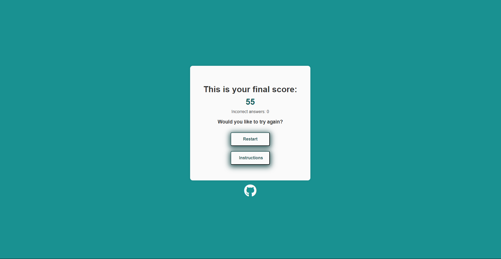

# Emotion Match Game


The Emotion Match Game is a online quiz game designed to improve people's emotion literacy by increasing their emotional vocabulary and thus to better express their feelings. The concept of the emotion wheel is widely present in the psychology field as well as schools. The game will be useful for people who  can't easily read emotional cues in social situations. That includes children, emotionally blocked adults and people with mental diagnostics that affect their social abilities.

The user must match the randomly given emotion with the image that best depicts it, increasing their final score.

## Table of contents
1. <a href="#ux-design">UX Design</a> 
2. <a href="#features">Features</a>
3. <a href="#usability">Usability</a>
4. <a href="#technologies-used">Technologies used</a>
5. <a href="#testing">Testing</a>
6. <a href="#bugs">Bugs</a>
7. <a href="#validator-testing">Validator testing</a>
8. <a href="#deployment">Deployment</a>
9. <a href="#credits">Credits</a>
10. <a href="#acknowledgements">Acknowledgements</a>

## UX Design

### Engagement:

The game is designed to keep users engaged through immediate feedback. Each round presents a new set of images and emotions, maintaining the user's interest and providing continuous learning opportunities.

### Accessibility:

The game’s design ensures that it is accessible to a wide range of users, including children and individuals with social or emotional learning challenges. Simple language, clear images, and intuitive controls make it easy for anyone to play and learn.

### Feedback Mechanism:

Visual feedback through color changes in the image shadow-box helps reinforce learning by clearly indicating correct and incorrect choices. This immediate feedback loop helps users quickly understand their mistakes and improve their recognition skills.

### Consistency:

The game maintains a consistent design language throughout all screens, using a cohesive color scheme, typography, and layout. This consistency helps users focus on the content and the learning process without being distracted by changing interfaces.

#### Color scheme


#### Favicon

The favicon was adapted from the original rendering of the Wheel of Emotions by Robert Plutchik, keeping the connection between the game and the original concept.


### Motivation:

By tracking and displaying the user’s score, the game provides a sense of achievement and encourages repeat play. Users are motivated to improve their scores and, consequently, their emotional literacy.
The time creates a feeling of challenge and urgency, making the game more compelling.

## Features

### Home page

The landing page includes:
- A title
- A welcome message
- The goal of the game 
- A list of instructions
- A Start button
- An icon linking to the project's GitHub page

 From the get go, the user knows what the game is about, why and how to play it.
Below the instructions, there is the centralized "Start!" button, taking the user directly to the first round of the game.


### Game page

The game page includes:

- A short instruction
- The emotion to be guessed
- A countdown timer
- Four images depicting different emotions
- An icon linking to the project's GitHub page

When clicked, a box-shadow will appear around the image. It will be either green if correctly guessed or red if wrongly.


#### Countdown

To create a more dynamic experience, I added a countdown timer on top of the given emotion. The timer starts at 10 seconds and, when it drops to zero, a new round is started.
If the user clicks, either correctly or incorrectly, on an image, the amount of seconds left in the timer are added to the overall score.

### Final score page

The final score page includes:

- The users final score, being the additional of seconds left every round
- A tally with the wrong answers
- A short invitation to play one more time
- A Restart button
- An Instructions button

The Instructions button will take the user back to the home page and the Restart button to a new first round, eliminating the need for using the "back button".



## Features left to implement

- Add variations of images depending of user cultural background.
    - Since different cultures have different physical reactions and expression to different emotions, one interesting features to be implemented in the future could be a variation in images or emotions depending on the user's origin.


## Usability

The game is designed to be intuitive and user-friendly. Upon launching the game, users are greeted with a welcome screen that provides an overview of the game's purpose and instructions on how to play. The user can start the game by clicking the "Start!" button, which initiates the first round.

During each round, the game presents the user with four images, each depicting different emotional expressions, and displays an emotion name at the top of the page. The user must click on the image that best represents the given emotion. The core functionality of the game revolves around several key functions:

1. `startNewGame()`: This function initializes a new game session, resetting the current round, score, incorrect answer count, and the list of correctly guessed emotions. It hides the home screen and displays the game screen.

2. `nextRound()`: This function sets up the next round of the game. It randomly selects four emotions, ensuring that previously correctly guessed emotions are excluded, and assigns these emotions to the four images. One of these emotions is chosen as the correct answer, which is displayed at the top of the screen. It also resets the countdown every round.

3. `checkAnswer()`: This function is triggered when the user clicks on an image. It checks if the selected emotion matches the correct emotion. If correct, the image's border turns green, and if incorrect, it turns red. The game then waits for a short duration before proceeding to the next round or displaying the final score if all rounds are completed. This waiting time (0.7s) is for the user to be able to see the shadow-box colour change. This function then defines the time left in the countdown and adds it to the score.

4. `showFinalScore()`: Once all rounds are completed, this function displays the user's final score by, including the number of incorrect answers.

5. `restartGame()`: This function allows the user to restart the game without returning to the initial instruction screen, enabling continuous play and practice.

6. `backToInstructions()`: This function takes the user back to the home screen with the instructions, in case they need a refresher on how to play the game.

---

## Technologies used

|Technology | Use|
|--|--|
|HTML| Structure the webpage
|CSS| Style and add layout to the project
|JavaScript| Make the website interactive; keep score based on the users choices and present the scores to them
|[Font Awesome](https://fontawesome.com/)| Used for the GitHub icon
|[GoogleFonts](https://fonts.google.com/)| Research, pair and add fonts to the project
|Adobe Photoshop| Create the favicon logo
|[Optimizilla](https://imagecompressor.com/)| Compress images
|[WEBP Converter](https://cloudconvert.com/webp-converter)| Convert jpg/png images to webp format
|[Favicon.io](https://favicon.io/favicon-converter/) | Create favicon files
|[AmIResponsive](https://ui.dev/amiresponsive?url=https://arthur-vilela.github.io/PP2-emotion-match/) | View and screenshot page in different devices

## Testing

| Test | Result |
|--|--|
|The buttons react when hovered | Pass |
|The home page is hidden when the start button is clicked |Pass|
|The game page displays when the start button is clicked |Pass|
|A new round is started when the start button is clicked |Pass|
|The images displayed are randomly chosen every round |Pass|
|The correctly guessed emotion is not shown again in the next round within the same play|Pass|
|The image displays a green border when correctly clicked|Pass|
|The image displays a red border when incorrectly clicked|Pass|
|The score is calculated and displayed on the final page|Pass|
|The wrong answer tally is calculated and displayed on the final page|Pass|
|The restart button on the final page starts a new play|Pass|
|The round counter, score and wrong answer tally are zeroed when the game is restarted|Pass|
|The "Instructions" button in the final page returns to the home page|Pass|

By running the game multiple times and observing the console output on Chrome Devtools, I verified that the correct emotion appears in a random position each time. The correctEmotionIndex will vary between 0 and 3, ensuring the correct emotion's image is displayed in a different position for each game round.

### User testing

- I asked five people of between 28 and 64 years old to play the game multiple times, during coding and after. They found the following bugs that are described in the following.
- All five people declared that they did not have any difficulties in understading and following the instructions of the game.

# Bugs
- When inspecting the deployed website and visualizing it on mobile resolutions, the top of the home page div touch the top and bottom of the screen, not showing the padding nor scrolling all the way. A margin was added to the .container `<div>` fixing the spacing issue.

    

- When viewed on mobile devices, the `homePageDiv` and the `finalScoreDiv` where not centered vertically on the page. This was fixed by adding a function changing the `<body` height attribute to 100% on mobile devices and to 100vh on larger screens

- Final score didn't update, keeping the placeholder text at the end of game.

    

    Chrome Devtools indicated the problem in the JavaScript:

    

    ```
    document.getElementById("final-scre").value = `Fi...
    ```

    instead of 

    ```
    document.getElementById("final-score").textContent = `Fi
    ```

- The same emotion could appear in subsequent rounds, since the emotions are selected randomly. To fix this, I:
    - added an array to store the correctly guessed emotions;
    - modified the `getRandomEmotions` function to exclude these emotions from the selection pool;
    - updated the `checkAnswer` function to add the correct emotion the the array when guessed correcly.

- One image wouldn't show and was described as undefined when playing the game. This happened after creating an array to contain the already chosen correct answers.

    - To fix it, I corrected the logic in `getRandomEmotions` function to properly filter out already guessed emotions and select random emotions from the available ones.

# Validator testing

### HTML

### CSS


### Lighthouse

- Lighthouse in devtools indicated a high accessibility score.
- Performance score varied when analysing  the `mobile` or `desktop` versions.

#### Mobile


#### Desktop


# Deployment

The site was deployed to GitHub pages. 
The steps to deploy are as follows:
- In the GitHub repository, navigate to the `Settings` tab
From the `Source` section drop-down menu, select the `Master Branch`
- In the next drop-down menu, select the `/root` option.
- Once the master branch has been selected, the page will be automatically refreshed with a detailed ribbon display to indicate the successful deployment.
- The live link can be found here 

    >https://arthur-vilela.github.io/PP2-emotion-match/

# Credits
- [Stackoverflow](https://stackoverflow.com/questions/2532218/pick-random-property-from-a-javascript-object) | Logic to obtain random emotions from the emotion object was adapted from this answer

- [W3Schools](https://www.w3schools.com/jsref/jsref_foreach.asp) | Explanation and examples of the "forEach" method were taken from this tutorial

- [Mdn Web Docs](https://developer.mozilla.org/en-US/docs/Web/JavaScript/Reference/Functions/Arrow_functions) | Explanation and syntax for arrow function (=>)

- Emotions were taken from the ["Wheel of emotions"](https://www.6seconds.org/2022/03/13/plutchik-wheel-emotions/) developed by psychologist Robert Plutchik

- Idea to change `div` display attribute instead of creating a new page came from my mentor Alan Bushell's [Geo Masters project](https://github.com/Alan-Bushell/geo-masters/)

- Base for creating round timer div came from [this answer on GeeksForGeeks](https://www.geeksforgeeks.org/how-to-add-a-circle-around-a-number-in-css/)

- All images were taken from the [Pexels](https://www.pexels.com/) website

- The base for the README.md file was taken from [Code Institute readme template](https://github.com/Code-Institute-Solutions/readme-template) on Github. 

# Acknowledgements
- My mentor Alan Bushell for great counceling and positive reinforcement
- My wife Kyra Sendler for giving psychological insight, user testing and telling me to take breaks